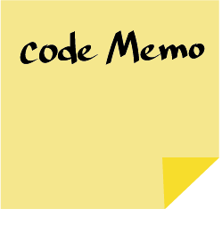

# codeMemo

codeMemo는 VS Code에 메모를 작성 할 수 있는 VS Code extension입니다.

코드에 메모를 생성하게 되면, 코드 옆에는 메모가 있다는 표시와, hover시 메모 내용을 볼 수 있는 창이 생성됩니다.

또한 메모가 모아져 있는 메모장 파일은 자동으로 .vscode폴더 내부로 들어가게 됩니다.

이제 코드에 메모를 편하게 적어보세요!

[VS Code Marketplace ](https://marketplace.visualstudio.com/items?itemName=HoChanLee.codememo)
  

# 🛫 바로 가기
- [💡 기획 동기](#-기획-동기)
- [📅 프로젝트 기간](#-프로젝트-기간)
- [🛠 기술 스택](#-기술-스택)
- [🖥 주요 기능](#-주요-기능)
- [🔥 어려웠던 점](#어려웠던-점)
- [🎬 프로젝트를 마치며](#-프로젝트를-마치며)

# 💡 기획 동기

**VS Code에 메모를 남기고 싶은데?**

개발을 처음 시작하였을 때, VS Code에 공부한 내용, 확인 할 점 등 많은 메모를 주석으로 처리하였습니다.

개발을 배워가면서 클린코드의 중요성을 배웠고, 불필요한 주석은 push할 때 지워줘야한다는 것을 알게되었습니다.

하지만, 여전히 특정 코드부분에 메모를 남겨야 할 경우가 있었고, 그 때마다 주석처리를 하고 추후 지우거나, 다른 메모 프로그램을 사용하게 되었습니다.

이러한 불편함을 해소하기 위해, vscode에서 사용 할 수 있는 메모장 codeMemo를 만들게 되었습니다.
  

# 📅 프로젝트 기간
- **[기획] :** 2022.02.21 ~ 2022.02.28 (1주)
- **[개발]** : 2022.02.28 ~ 2022.03.13 (2주)
  

# 🛠 기술 스택
- JavaScript
- React
  

# 🖥 주요 기능
- 

  
메모 생성 순서

  

    

      1. 메모를 저장하고 싶은 라인에서 오른쪽 마우스 클릭.
      2. codeMemo 메뉴에서 createMemo선택.
      3. 혹은 메모를 저장하고 싶은 라인에서 ctrl+shift+P 눌러 Command Pallet 오픈. createMemo 검색 후 엔터키 누름.
      4. 메모 생성창에서 메모 작성 후 save 클릭.)

  

- 

  
메모장 가기

  

    

    1. 하단 status Bar 우측의 codeMemo 클릭.
    2. 메모가 저장된 코드에 마우스를 올리면, 저장된 메모와 함께 gotoCode 링크 띄어짐. 링크 클릭.
    3. "memoBoard.memo" 파일 열기.
    4. 메모가 저장된 코드에 우측 마우스 클릭. codeMemo 메뉴에서 gotoMemo 클릭.
    5. 메모가 저장된 코드에서 Command Pallet오픈 (ctrl+shift+P) 후, goToMemo 검색 후 엔터.

  

- 

  
메모 삭제

  

    

    1. 메모장에서 삭제하고싶은 메모우측 상단 'x'클릭.
    2. 지우고 싶은 메모가 있는 코드에서 우측 마우스 클릭. codeMemo 메뉴에서 deleteMemo 클릭.
    3. 지우고 싶은 메모가 있는 코드에서 Command Pallet오픈 (ctrl+shift+P) 후, deleteMemo 검색 후 엔터.

  

# 🔥 어려웠던 점
## **VS Code API**

  과거에 몇몇 라이브러리를 사용 해보았지만, 라이브러리 자체의 기능이 적거나 라이브러리를 이용하여 구현하려는 기능이 적었습니다.

  이에 반해 이번 codeMemo Extension을 제작하기위해 사용한 VS Code API는 그 자체 기능의 양이 많을 뿐더러, 제가 구현 하려는 기능이 VS Code API에 의존성이 많아, 주어진 시간의 많은 부분을 VS Code API를 조사하고, 공부하는데 할애하였습니다.

  가장 큰 문제는 제가 원하는 기능이 VS Code API에 존재 하는지 여부를 찾는 것 이었습니다. 공식 문서를 확인하여 원하는 기능이 될것이라 예상되는 후보를 뽑아 놓았습니다. 공식 문서의 설명이 잘 되어있었지만 정확한 예시는 나오지 않아 어떻게 사용되는지 의아한 부분들은 다른 extension의 코드를 분석하여, 후보군에서 추려서 실제 사용을 해보는 식으로 진행 하였습니다.

  VS Code Extension 관련 Refernce 가 적어 learning curve가 높았습니다. 하지만 앞으로 새로운 기술을 접할 때, 어떤 진입장벽이 있다 하더라도 스스로 해결나갈 수 있겠다는 자신감과 저에게 맞는 습득 방법을 얻을 수 있는 기회였다고 생각 됩니다. 또한 저에게는 하나의 도전이었기에 큰 성취감을 얻을 수 있었습니다.

  

    
<b>익스텐션 실행 구조</b>

    

      Code Memo는 VS Code API 중 Webview와 Custom Editor API 기능을 주로 사용합니다.
      Webview는  VS Code 내부에서 extension이 조절하는 iframe 이라고 생각 할 수 있습니다. Webview는 대부분의 HTML 컨텐츠를 렌더링 할 수 있고, Code Memo는 React를 사용하여 웹뷰를 구성하였습니다.
      
      Webview를 front단 이라고 생각을 하면, server에 해당하는 부분이 extension, db에 해당되는 부분은 로컬 File이라고 할 수 있습니다. Front에서 발생한 Evnet가 extension 혹은 Local file에 영향을 주고 싶다면, 메시지 패싱이라는 기능을 사용해야합니다. 메시지 패싱은 extension과 Webview 사이에 일어나는 통신으로 이를 통하여, 값을 주고 받을 수도, 해당 메세지에 따라 extension이나 Webview에서 특정 action을 실행 시키는 것도 가능합니다.

      Webview내에서 로컬 File에 직접 접근 하는것은 불가능합니다. 따라서 로컬 file을 다룰 때에는 extension을 통해 action이 일어나게 다뤄야합니다.

      Custom Editor API는 VS Code의 text editor(local file)를 바탕으로 Webview를 구성 합니다. 동일하게 Webview를 사용하지만, 익스텐션에서 따로 로컬 file을 불러오는 것이 아닌, 특정 조건에 맞는 file이면, 동일하게 구성을 해주는 특징이 있습니다. CodeMemo의 memoBoard는 Custom Editor API의 이런 특징을 사용하였습니다.

   
    

  

    

## **코드 추적**

  개발에서 시간과 노력이 가장 많이 들어간 부분이 코드 추적입니다. 단순히 코드의 몇번 째 라인에 메모를 추가하는 것으로 끝내는 것이 아니라 action에 따라 메모가 해당 코드를 추적을 해야 실제 사용 가능한 extension을 제작하는 의미가 있을 것이라 생각하였습니다.

  메모 작성 후 코드를 작성 및 삭제하여 메모가 저장된 코드의 라인위치가 변경 되었을 때, 메모를 작성 후 코드를 저장하지 않고 종료했을 때 등 여러가지 상황에 따라 메모에 저장된 라인 코드가 수정되기도, 메모가 삭제되기도 해야했습니다. 동시에 코드 옆의 gutter Image 또한 함께 이동을 해서 시각적으로 메모가 이동 됨을 보여주고 싶었습니다.

  이를 위해 실제 저장되는 메모데이터와 별개로, temp데이터를 만들어 주었고, 파일에 메모 저장 유무, 파일안의 코드 변화, 현재 저장이 된 상태 등 에 따라 flag를 주어 메모가 코드를 추적 할 수 있도록 설계 하였습니다.

- ### **라인 변경**
  저장된 메모의 라인이 변할 때, 추적할 수 있도록 하였습니다. 라인이 아래로 내려갈 때, 해당 라인에 코드가 남아있으면 (코드 중간에 엔터) 메모는 그 라인에 그대로 유지되고, 코드가 없으면(코드의 앞에서 엔터) 같이 내려 갈 수 있도록 구현 하였습니다.
- ### **Temp Data 생성**
  초기에 local File(memoBoard)에 데이터를 저장하고, extension에서 그 data를 읽어오는 방식으로 코드추적을 하였습니다.
  메모가 저장된 라인이 바뀔 경우, local File도 update되어 저장하는 방식으로 구현을 하였는데, 이 경우 코드를 저장하지않고 파일을 끄게 되면 메모가 원상복귀 되지않고, 파일을 끄기 전에 위치한 라인이 유지되었습니다.

  해결 방법으로 Temp Data를 이용하였습니다. 메모가 저장되어있는 파일이 처음 수정 될 때, memoBoard에서 데이터를 불러오고, 이를 복사하여 Temp Data에 저장하였습니다. 메모가 저장된 라인이 변경 되면, Temp Data는 변경 되지만, memoBoard자체는 update되지 않습니다. 파일을 저장하게 될 때, Temp Data가 local File에 덮여 씌워 질 수 있도록 하여 문제를 해결하였습니다.

  local File의 데이터 사용하던 기존 방식을 모두 Temp Data로 변경하는 큰 작업이었지만, 함수를 분리 시켜놓아 보수가 용이하였습니다. 이를 통해 코드는 항상 바뀔 수 있는 가능성이 있으므로 유지보수성이 얼마나 중요한지를 깨달을 수 있었습니다.

- ### **수정 중 메모 생성에 따른 state 주기**
  위 방법으로도 해결되지 않은 이슈가 있었습니다. 코드 수정 중 메모를 새로 생성을 하고, 코드를 저장하지 않고 파일을 끄게 되면 생성 된 메모가 삭제 되지 않고 남아있다는 점이었습니다. 임시로 Temp Data에만 추가하고 저장 혹은 삭제하는 방식을 생각했지만 그럴 경우 memoBoard Page를 구현 하였을 때, 생성된 메모가 보이지 않는다는 문제가 충돌 하였습니다.

  따라서, 현재 문서가 수정 중인 상태인지, 저장이 된 상태인지를 판단하여 메모를 새로 생성할 때 state를 주었습니다. 이 state를 통하여 이 메모가 임시로 생성된 상태인지, 저장된 상태인지를 나타냄과 동시에 memoBoard에서도 메모가 보일 수 있도록 하였습니다.

- ### **파일 이동** (미완성)
  메모가 들어있는 파일을 다른 폴더로 이동 시, 들어 있는 메모도 모두 이동 할 수 있도록 하였습니다.
  한가지 아쉬운 점은, 이동 하려는 파일이 저장 된 상태에서만 정확히 구현이 된다는 점입니다.

  만약 이동하려는 파일이 수정 중인 상태라면, 마지막으로 저장된 시점의 메모로 돌아가게됩니다. 이는 파일이 열려있는 상태에서 다른 폴더로 이동 할 때, 파일의 주소만 변경되는 것이 아닌, 파일 자체를 종료시키고 다시 열리는 작업이 일어나게 됩니다. 이 때, 위에서 구현했던 temp Data 작업과 충돌이 일어나게 되어 기존 저장된 상태로 돌아가게 되었습니다.
  향후 이를 개선하여 파일이 다른 폴더로 이동할 때, 메모가 완벽히 이동 할 수 있도록 하고싶습니다.  

# 🎬 프로젝트를 마치며
  저의 첫 개인프로젝트이자, 바닐라 코딩에서의 마지막 결과물인 만큼 기획에서 부터 굉장히 고민을 많이 했습니다. 내가 흥미가 더 가는 주제로 할 것인가, 조금 더 도전적인 주제를 할 것인가. 본래의 성격대로라면 내가 더 재밌어 하는 것을 선택했겠지만, 이번만큼은 도전 자체를 즐겨보자는 마음으로 VS Code extension 개발을 선택 했습니다. 그리고 이 선택은 저에게 많은 것을 남겨주었습니다.

 첫번 째 깨달음은 바로 성취의 즐거움입니다.

 처음 VS Code API의 방대함을 접했을 때, extension개발의 가장 기본이 되는 extension generator가 설치가 안될 때 등, 멘탈이 흔들리고 포기를 해야하나 라는 생각이 들 때도 있었습니다. 하지만 그러한 어려움을 하나하나 해결하고 타파할 때 나오는 성취감이 매번 위기를 버틸 버팀목이 되어주었습니다. 또한 스스로 조사하고 해결을 하면서 생기는 희열의 긍정적 감정이 주제의 흥미를 넘어서는 순간, 이전에 고민했던 다른 주제를 생각나지도 않게하는 경험도 하게 되었습니다. 이렇듯 작은 성공일지라도 성취를 했을 때의 만족감이 저에겐 중요하다는 것을 알게 되었습니다.

 다음은 목적의 중요성입니다. 혼자 개발을 하면서 가장 큰 적은 스스로와의 타협이었습니다. 이 적을 물리 칠 수 있었던 것은 목적이었습니다.

 개발을 하면서 이따금 제가 만든 익스텐션이 엄청나게 다운 및 공유가 되어 VS Code를 사용하는 개발자라면 누구나 들어보고 다운받는, 마치 git graph나, prettier같은 extension이 되는건 아닐까라는 발칙한 상상을 하기도 하였습니다. 그리고 솔직히 그렇게 만들어보고 싶었습니다. 이러한 목적이 ‘이게 될까? 여기까지만 할까? 이런 부분까지 생각해야할까?’ 라는  고민이 들 때, “해보자"라는 답을 스스로에게 하게 해주었습니다. 그렇게 여러 경우의 수를 생각하여 최대한 사용자의 입장에서 불편하지 않을 수 있도록 대응할 수 있었습니다.

  마지막은 개인프로젝트에 역설적이게도 팀원 및 주변사람들의 소중함입니다.

 문제에 봉착했을 때, 정신적으로 육체적으로 힘이 부칠 때, 어려웠던 기능 구현을 성공했을 때 등 팀프로젝트에서는 당연히 같이 했던 모든 것들을 혼자서 해야했습니다. 이는 스스로 해결하는 힘을 알게 해줌과 동시에, 팀원들이 저에게 얼마나 큰 힘이 되어줬는지를 알게 해주었습니다. 또한 바코에 나와 함께 코딩하는 분위기를 만들 어주고, 힘이 들 때면 격려해주던 동기들. 스스로와 타협을 하려하면 한마디 해주시는 켄님. 이 모두가 저에게 너무 큰 버팀목이 되어준다는 것을 깨달았습니다.

 아쉬움도 많이 남았습니다. VS Code extension이 TypeScript를 base로 구현이 되는데, JavaScript로 구현을 하게 된점. 파일 이동 등 기타 action에서 코드 추적이 완벽하지 못한점. 조금 더 집중하고 조금 더 시간을 쏟을 껄이라는 후회. 하지만 이러한 아쉬움과 뿌듯함 모두가, 스스로 더 발전하는 개발자가 될 것이라는 믿음을 갖고 나아가겠습니다.